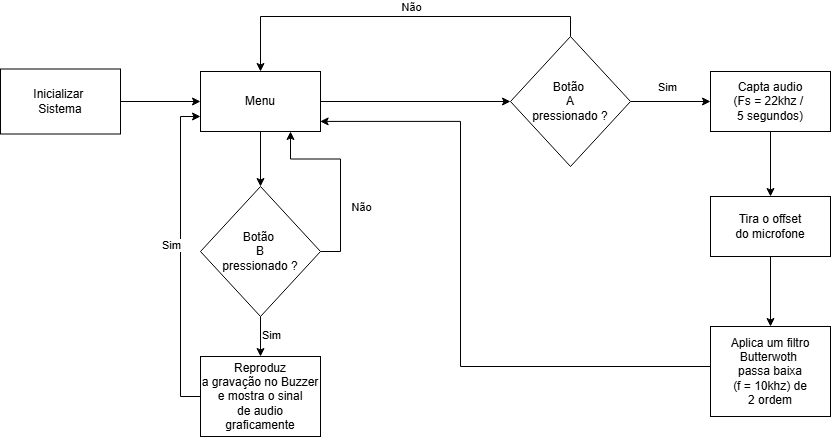

# Projetos de Sistemas Embarcados - EmbarcaTech 2025

Autor: **Guilherme Achilles de Oliveira e Aguiar**  
Curso: Residência Tecnológica em Sistemas Embarcados  
Instituição: EmbarcaTech - HBr  
Brasília, 09/05 de 2025

# 🎙️ Sintetizador de Áudio com Raspberry Pi Pico

Este projeto implementa um **sintetizador de áudio digital** utilizando o **Raspberry Pi Pico**. A partir de sinais capturados por um microfone, o sistema realiza o tratamento do sinal e gera uma resposta sonora por meio de um buzzer, com feedback visual em um display OLED. O sistema também conta com botões de controle e LEDs para interação e sinalização. 

Todo o projeto foi modularizado para facilitar o desenvolvimento, testes e manutenção do código.


🛠️ Estrutura do Projeto
```bash
├── app/                           # Aplicação principal (controle do sintetizador)
│   └── Sintetizador_de_Audio_definitivo.c
├── driver/                        # Drivers de hardware (LEDs, Microfone, Buzzer, Display, etc.)
│   ├── button.c                   # Driver para botões
│   ├── buzzer.c                   # Driver para buzzer/alto-falante
│   ├── led.c                      # Driver para LEDs convencionais
│   ├── microphone.c               # Driver para captura de áudio
│   ├── neopixel.c                 # Driver para LEDs endereçáveis
│   ├── ssd1306.c                  # Driver base do display OLED
│   ├── ssd1306_i2c.c             # Comunicação I2C com display
│   └── ws2818b.pio                # Programa PIO para LEDs WS2812B
├── hal/                           # Abstrações de hardware e controle de alto nível
│   ├── show_display.c             # Funções de exibição no display
│   ├── signal_tratament.c         # Tratamento e processamento de sinais
│   └── write_display.c            # Escrita de dados no display
├── include/                       # Headers compartilhados entre os módulos
│   ├── button.h                   # Definições para controle de botões
│   ├── buzzer.h                   # Definições para controle do buzzer
│   ├── font.h                     # Fontes personalizadas
│   ├── led.h                      # Definições para controle de LEDs
│   ├── microphone.h               # Definições para captura de áudio
│   ├── show_display.h             # Definições para exibição
│   ├── signal_tratament.h         # Definições para processamento de sinais
│   ├── ssd1306.h                  # Definições do driver do display
│   ├── ssd1306_font.h             # Fontes do display OLED
│   ├── ssd1306_i2c.h             # Definições I2C do display
│   └── write_display.h            # Definições para escrita no display
├── CMakeLists.txt                 # Configuração para build com CMake
├── pico_sdk_import.cmake          # Inclusão do SDK da Raspberry Pi Pico
├── .gitignore                     # Arquivos/pastas ignorados pelo Git
└── build/                         # Arquivos gerados pela compilação (não versionado)
```

### 🚦 Fluxograma de Uso

<p align = "center">
    
</p>

Menu Inicial
Ao ligar o Pico, o display exibe duas opções:

Botão A: iniciar gravação de 5 segundos

Botão B: reproduzir o áudio previamente gravado

Modo Gravação

O ADC lê continuamente o sinal do microfone a 22 kHz.

O DMA transfere 110 000 amostras para adc_buffer[], liberando o processador.

Após 5 s, a captura é interrompida automaticamente.

Modo Reprodução

O buffer de 110 000 amostras é enviado amostra a amostra ao buzzer.

Cada valor do buffer adc_buffer[] é enviado para o PWM.

Simultaneamente, o display OLED mostra a forma de onda: cada uma das 128 colunas representa a média de 859 amostras, normalizada pelo pico.


## 🎙️ Configuração da Captura de Áudio

1. **Inicialização do ADC e DMA**  
   - Configuramos o ADC interno do Pico para ler o sinal do microfone no pino ADC2 (GPIO 28).  
   - Em seguida, habilitamos o **DMA** para transferir automaticamente cada amostra do FIFO do ADC para um buffer na RAM, liberando o processador de transferências “manuais”.

2. **Taxa de Amostragem**  
   - Ajustamos o clock do ADC via `adc_set_clkdiv()` para obter **22 000 amostras por segundo** (22 kHz).  
   - Essa taxa cobre confortavelmente toda a faixa de voz humana (até ~8 kHz) sem aliasing perceptível.

3. **Buffer de Captura**  
   - Declaramos um vetor `uint16_t adc_buffer[110000]`, suficiente para **5 segundos** de áudio contínuo a 22 kHz:  
     \[
       22\,000\;\text{amostras/s} \times 5\;\text{s} = 110\,000\;\text{amostras}
     \]
   - Após a chamada a `sample_mic()`, o DMA preenche integralmente esse buffer com as amostras, em background.


### 🔊 Processamento de Áudio

Após a captura de 5 segundos de áudio, o vetor `adc_buffer[]` contém 110 000 amostras brutas no intervalo **0–4095**. Para preparar o sinal para reprodução e análise, realizamos duas etapas principais:

1. **Remoção do Offset (Componente DC)**
   - O microfone retorna um sinal AC deslocado para caber na faixa positiva do ADC (zero em 2048).  
   - Subtraímos este valor de cada amostra para recenter o sinal em torno de zero:
     ```c
void remove_offset(int16_t *data, int len) {
    if (len < 1) return;

    // Calcula o offset (média)
    int32_t sum = 0;
    for (int i = 0; i < len; i++) {
        sum += data[i];
    }
    int16_t offset = sum / len;

    // Subtrai o offset de cada amostra
    for (int i = 0; i < len; i++) {
        data[i] = 2*(data[i]-offset);
    }
}
     ```
   - Isso elimina o “ruído” de fundo contínuo e preserva apenas a variação útil do áudio.

2. **Filtro Butterworth de 2ª Ordem (Passa-Baixa)**
   - Mesmo após a remoção do offset, ruídos de alta frequência (>10 kHz) podem prejudicar a reprodução.  
   - Aplicamos um filtro **Butterworth** de segunda ordem, com **frequência de corte em 10 kHz**, para atenuar esses componentes:
     ```c
     // Pseudocódigo de implementação direta
     float x0 = (float)centered;
     float y0 = b0*x0 + b1*x1 + b2*x2
                - a1*y1 - a2*y2;
     // Atualiza históricos (x2 ← x1, x1 ← x0; y2 ← y1, y1 ← y0)
     ```
   - **Coeficientes (`b0, b1, b2, a1, a2`)** pré-calculados com ferramenta (Python/SciPy) garantem resposta plana na banda de voz e rejeição gradual acima de 10 kHz.

---

Com o sinal agora livre de offset e filtrado, ele está pronto para ser recodificado em **duty cycle PWM** e reproduzido no buzzer com fidelidade máxima dentro dos limites do hardware.


### 🔊 Reprodução do Sinal

Para repodruzir o sinal, inicializamos o pwm do buzzer com uma frequencia de 30000 Khz, usando o divisor de clock adequado.

Depois disso, foi criado uma função o qual passa o sinal do adc_buffer[], para o buzzer, amplificando 2 vezes o sinal para sua intensidade ser maior.

Ao passar para o buzzer, usamos uma função sleep_us(30), para a reprodução do audio, acelerando um pouco o sinal para a sua melhor performance. Assim chegamos a um resultado razoavel.


### 🎯 Representação gráfica do sinal

1. **Segmentação do Sinal
- Vector[TOTAL_AMOSTRAS] → 128 Blocos → Display[128×64]

O array de amostras int16_t dados[] é dividido em 128 segmentos
Cada segmento corresponde a uma coluna do display
Tamanho do bloco: TOTAL_AMOSTRAS ÷ 128 amostras por coluna

2. **Processamento Estatístico
- Bloco[n] → Média Aritmética → Valor Representativo

- Cálculo da média: Cada bloco é reduzido a um único valor através da média aritmética
- Redução de ruído: A média suaviza variações abruptas e outliers
- Representação temporal: Mantém as características gerais da forma de onda

3. **Normalização Adaptativa
- Sinal Processado → Detecção de Pico → Normalização → Escala 0-64

- Detecção do pico: Identifica o maior valor absoluto do sinal completo
- Normalização proporcional: altura = (média_bloco ÷ pico_global) × altura_display
- Aproveitamento total: Utiliza toda a altura disponível do display (64 pixels)

4. **Renderização Centrada
- Valores Normalizados → Centralização → Barras Simétricas

- Linha de referência: Centro vertical do display (pixel 32)
- Simetria: Valores positivos e negativos são representados simetricamente
- Visualização bipolar: Permite análise completa da forma de onda AC

5. **Amplificação Inteligente
- if (amplitude_baixa) → Fator_Amplificação → Melhor_Visibilidade

- Detecção automática: Identifica sinais de baixa amplitude
- Ganho visual: Aplica fator de amplificação para sinais fracos
- Preservação da forma: Mantém as proporções relativas do sinal original

### Video do funcionamento

https://youtube.com/shorts/mDe84JE2Ik0
